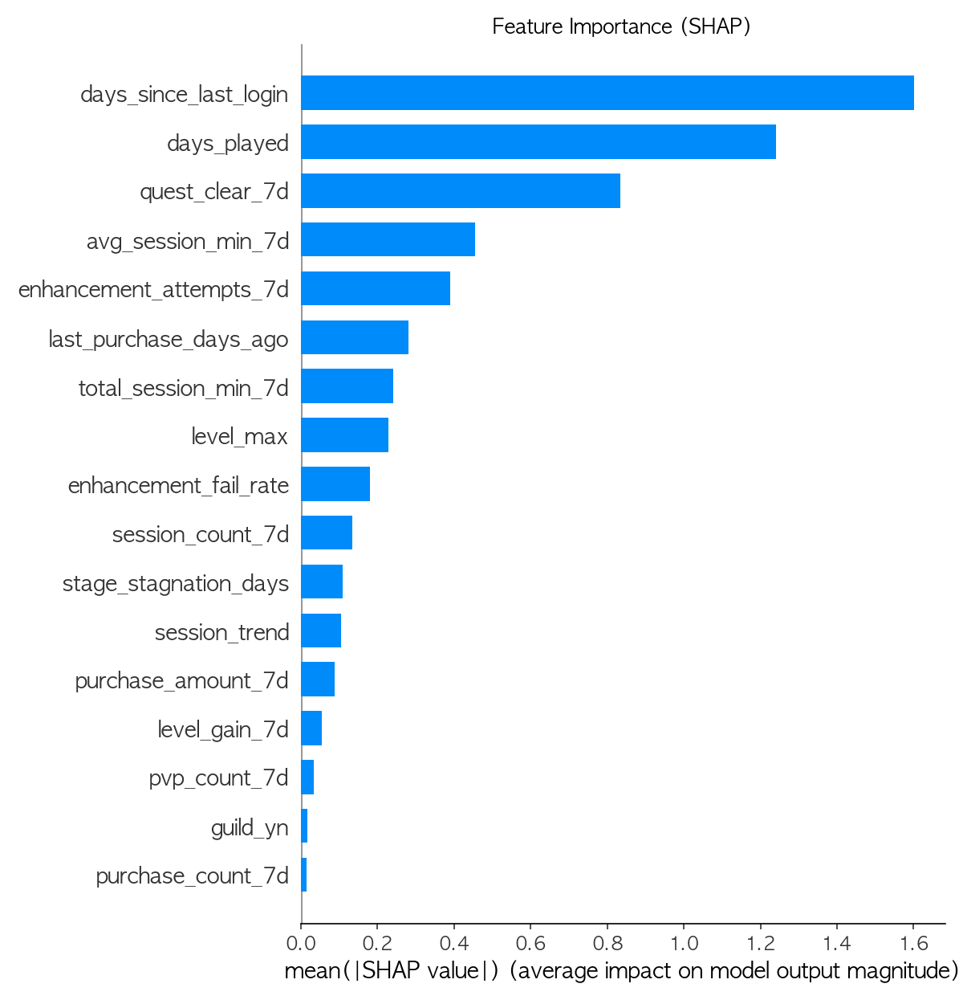
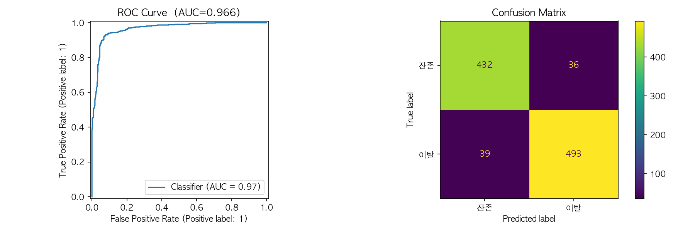
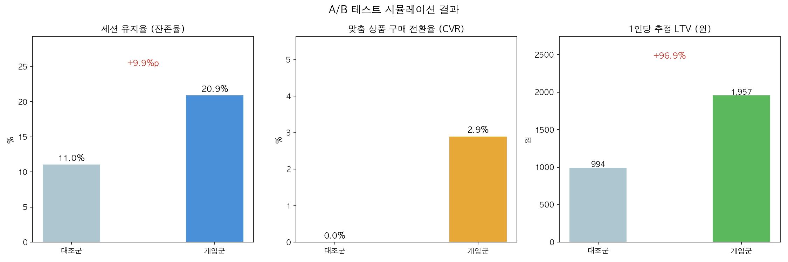

# 에이전틱 AI를 통한 유저 LTV 극대화 파이프라인

> MMORPG 유저의 7일치 플레이 로그를 AI가 분석하여 이탈 위험을 감지하고,  
> 다음 접속 시 NPC가 자연스럽게 개입해 잔존과 결제를 유도하는 통합 파이프라인

---

## 배경 및 문제 정의

2026년 게임 산업은 두 가지 구조적 과제에 직면해 있습니다.

- **유저 성장 정체**: 신규 유저 확보 한계 → 기존 유저 리텐션이 핵심 전략으로 이동
- **BM 규제 강화**: 확률형 아이템 단일 의존 구조의 리스크 증가  
  (2024 확률 공개 의무화 → 2025 3배 배상 → 2026 피해구제센터 출범)

기존 이탈 방지 방식의 문제는 **"비개인화 개입"** 입니다.  
MDPI 2022 연구(80M+ 유저 실험)에서 무차별적 보상 지급이 이탈율에 유의미한 영향을 주지 못함이 증명됐습니다.

**본 프로젝트는 이탈 원인별 맥락에 맞는 NPC 개입으로 이 한계를 해결합니다.**

---

## 핵심 아이디어

```
[유저의 7일치 플레이 로그]
        ↓
[배치 분석 — 이탈 확률 + 원인 분류]
        ↓
[개입 시나리오 결정]
        ↓
[다음 접속 시 NPC 트리거]

  대장장이: "요 며칠 강화를 12번 실패했군...
             이 재료를 써보게, 성공률이 다를 걸세."
        ↓
[맞춤 퀘스트 + 상품 연결]
```

유저는 AI 개입인지 모릅니다. 게임 세계관 안에서 자연스러운 NPC 상호작용으로 경험합니다.

---

## 차별점

기존 연구/제품과의 비교:

| 항목 | NCSoft | NetEase | Rovio | **본 프로젝트** |
|---|:---:|:---:|:---:|:---:|
| 이탈 감지 | O | O | O | **O** |
| 개인화 개입 | X | 팝업 수준 | 난이도 조절 | **NPC 대화** |
| 과거 행동 참조 | X | X | X | **O** |
| 퀘스트 연결 | X | X | X | **O** |
| 맞춤 상품 추천 | 일부 | O | X | **O** |
| 통합 파이프라인 | X | 일부 | X | **O** |

> 각 구성 요소는 검증된 기술이지만,  
> **이탈 감지 → NPC 개입 → 퀘스트/상품 연결을 하나로 연결한 공개 구현체는 없습니다.**

---

## 시스템 아키텍처

```
┌─────────────────────────────────────────────────┐
│  게임 서버  →  플레이 로그 적재 (S3)              │
└──────────────────┬──────────────────────────────┘
                   ↓
┌─────────────────────────────────────────────────┐
│  배치 분석 파이프라인 (1일 1회)                   │
│                                                  │
│  S3 → Athena → Feature Engineering (7일 집계)   │
│                      ↓                           │
│           XGBoost 이탈 예측 모델                  │
│                      ↓                           │
│        이탈 확률 + 원인 분류 (Rule-based)         │
└──────────────────┬──────────────────────────────┘
                   ↓
┌─────────────────────────────────────────────────┐
│  시나리오 엔진                                    │
│                                                  │
│  이탈 원인 → NPC 대사 + 퀘스트 + 상품 결정        │
└──────────────────┬──────────────────────────────┘
                   ↓
┌─────────────────────────────────────────────────┐
│  게임 클라이언트 (다음 접속 시)                   │
│  NPC 트리거 → 개인화 대화 → 퀘스트/상품 제안      │
└─────────────────────────────────────────────────┘
```

**PoC 환경:** 실제 게임사 로그는 비공개 자산이므로, 전략서에서 정의한 이탈 시나리오(강화 실패, 구간 정체, 접속 감소, 결제 이탈)를 기반으로 게임 행동 패턴을 직접 설계하여 합성 데이터를 생성했습니다.

**프로덕션 확장:** S3 + Athena → SageMaker 엔드포인트 → Kinesis(DAU 급증 시) 순서로 단계적 확장을 설계했습니다.

---

## 이탈 원인별 NPC 시나리오

| 이탈 원인 | 트리거 NPC | 대사 예시 | 제안 |
|---|---|---|---|
| 강화_실패 | 대장장이 로스반 | "요 며칠 강화를 N번 실패했군... 이 재료를 써보게" | 강화 성공률 보조 아이템 퀘스트 |
| 구간_정체 | 용사 길드장 에리아 | "N일째 같은 구간에서 고생하고 있구나. 동료를 소개해줄까?" | 파티 매칭 + 구간 클리어 퀘스트 |
| 접속_감소 | 여관 주인 마르타 | "N일 만이군요. 특별히 준비한 게 있어요" | 복귀 보상 + 한정 아이템 |
| 결제_이탈 | 협회장 드레이크 | "특별 지원을 해줄 수 있는데... 관심 있나?" | 시즌 패스 50% 할인 |
| 일반_피로 | 여관 주인 마르타 | "오늘 하루는 특별 버프를 드릴게요" | 소모성 버프 아이템 |

> NPC 대사는 유저의 실제 행동 데이터를 참조합니다.  
> "N일 만이군요" → 실제 `days_since_last_login` 값 반영  
> "강화를 N번 실패했군" → 실제 `enhancement_fails_7d` 값 반영

---

## PoC 결과

### 이탈 예측 모델

| 지표 | 결과 | 목표 |
|---|---|---|
| AUC | **0.9656** | > 0.75 |
| F1 Score | **0.9293** | — |
| Precision (이탈) | 0.93 | — |
| Recall (이탈) | 0.93 | — |

### A/B 테스트 시뮬레이션

| 지표 | 대조군 | 개입군 | 개선폭 | 목표 |
|---|---|---|---|---|
| 세션 유지율 | 11.0% | 20.9% | **+9.9%p** | +10%p |
| 맞춤 상품 CVR | 0.0% | 2.9% | **+2.9%p** | +3%p |
| 1인당 LTV | 994원 | 1,957원 | **+96.9%** | +15% |

### SHAP Feature Importance



### 모델 평가



### A/B 테스트 결과



---

## 프로젝트 구조

```
AI_LTV/
├── run.py                      # 전체 파이프라인 실행
├── environment.yml             # Conda 환경 설정
│
├── src/
│   ├── data_generator.py       # MMORPG 합성 데이터 생성 (5,000명 × 90일)
│   ├── preprocessing.py        # Feature Engineering (7일치 18개 피처 집계)
│   ├── model.py                # XGBoost 이탈 예측 + SHAP 해석
│   ├── scenario_engine.py      # NPC 시나리오 엔진 (원인 → 대사/퀘스트/상품)
│   ├── simulation.py           # A/B 테스트 시뮬레이션 + 시각화
│   └── make_report.py          # Word 보고서 자동 생성
│
├── data/
│   ├── raw/                    # 생성된 원본 로그 CSV
│   └── processed/              # 피처, 개입 계획
│
├── models/                     # 학습된 XGBoost 모델
├── reports/                    # 평가 차트 3종 + Word 보고서
└── docs/
    └── AI_LTV_구현설계서.md    # 상세 설계 문서
```

---

## 실행 방법

```bash
# 1. 환경 설정
conda env create -f environment.yml
conda activate ai-ltv

# 2. 전체 파이프라인 실행 (데이터 생성 → 모델 학습 → A/B 시뮬레이션)
python run.py

# 3. Word 보고서 생성
python src/make_report.py
```

실행 후 `reports/` 폴더에서 결과를 확인할 수 있습니다.

---

## 피처 설계 (18개)

```python
# 세션 패턴
"session_count_7d"       # 7일 접속 횟수
"avg_session_min_7d"     # 평균 세션 시간(분)
"session_trend"          # 후반 3일 / 전반 4일 세션 비율 (1 미만 = 감소)
"days_since_last_login"  # 마지막 접속 이후 경과일

# 행동 패턴
"enhancement_attempts_7d"  # 강화 시도 횟수
"enhancement_fail_rate"    # 강화 실패율
"quest_clear_7d"           # 퀘스트 클리어 수
"pvp_count_7d"             # PvP 참여 횟수

# 성장
"level_max"              # 현재 레벨
"level_gain_7d"          # 7일 내 레벨 상승
"stage_stagnation_days"  # 동일 구간 정체 일수
"guild_yn"               # 길드 가입 여부
"days_played"            # 총 플레이 일수

# 결제
"purchase_count_7d"      # 7일 내 결제 횟수
"purchase_amount_7d"     # 7일 내 결제 금액
"last_purchase_days_ago" # 마지막 결제 이후 경과일
```

---

## 리스크 및 대응

| 영역 | 위험 | 대응 |
|---|---|---|
| 보안 | AI 에이전트 로직 변조, 비정상 상품 제안 | 룰 기반 검증 레이어 + 전체 감사 로그 기록 |
| 인프라 비용 | 실시간 AI 추론 비용 급증 | SageMaker(경량) + Inferentia(배치) 워크로드 분리 |
| 규제 컴플라이언스 | 확률 미표기 등 위반 소지 | AI 제안 상품 자동 로깅 컴플라이언스 파이프라인 |
| 유저 신뢰 | "AI가 과금 유도" 인식 | 분기별 투명성 보고서 공개 + 옵트아웃 보장 |

---

## 로드맵

| 단계 | 기간 | 핵심 액션 | Go 기준 |
|---|---|---|---|
| **PoC** ✅ | 1~3개월 | 합성 데이터, 이탈 감지 모델, NPC 시나리오, A/B 시뮬레이션 | AUC > 0.75 → **달성 (0.9656)** |
| 파일럿 | 4~6개월 | 실제 게임 로그 연동, AI 맞춤 상품 제안, BM 전환 실험 | D7 리텐션 +5%p, CVR +3%p |
| 확대 적용 | 7~12개월 | 전체 유저 확대, 인프라 스케일링, LLM 연동 | LTV +15%, 월 이탈률 -8%p |

---

## 참고 자료

- NCSoft / IEEE CIG 2017 — [Game Data Mining Competition on Churn Prediction](https://arxiv.org/abs/1802.02301)
- NetEase — [perCLTV: A General System for Personalized Customer Lifetime Value Prediction](https://dl.acm.org/doi/10.1145/3530012)
- Rovio — [Machine Learning Meets Puzzle Game Design](https://www.rovio.com/articles/machine-learning-meets-puzzle-game-design/)
- MDPI 2022 — [Predicting Player Churn of a Free-to-Play Mobile Video Game](https://www.mdpi.com/2076-3417/12/6/2795)
- PLOS One 2017 — [Churn prediction of mobile and online casual games](https://journals.plos.org/plosone/article?id=10.1371/journal.pone.0180735)
- ACM CHI 2023 — [Personalized Quest and Dialogue Generation in Role-Playing Games](https://dl.acm.org/doi/10.1145/3544548.3581441)
- Playio Blog — [Churn and LTV Relationship](https://blog.playio.co/churn-and-ltv-relationship)

---

## 작성자

**전찬혁** | 사업 PM 지원자  
IT 보안 및 클라우드 인프라 특화  
2026. 04
